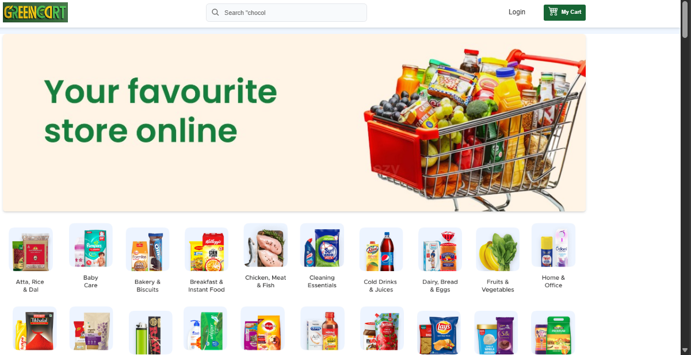
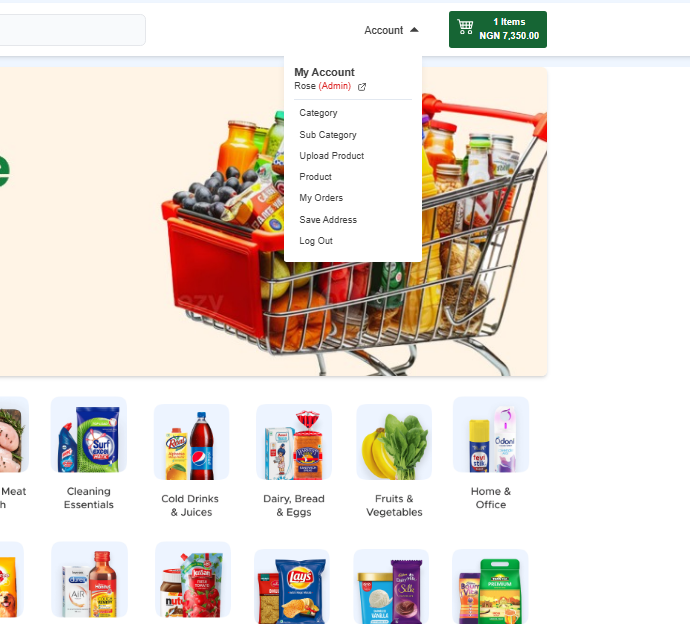
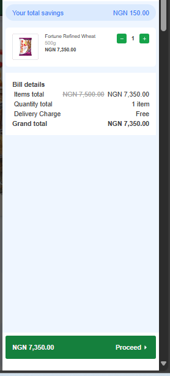

GreenCart - E-commerce Platform

A full-featured, production-ready e-commerce web application built with the MERN stack, featuring secure payment processing, admin dashboard, and OTP verification for sustainable grocery shopping.


🌐 Live Demo

Frontend: https://spontaneous-taffy-2a390e.netlify.app  
Status: ✅ Live & Functional

Admin Credentials (for testing):
- Email: chukwukarosemary2020@gmail.com
- Password: 1234567

✨ Key Features

For Customers:
- 🔐 User Authentication - Secure registration and login with JWT
- 📧 OTP Email Verification - Password reset functionality via email
- 🛍️ Product Catalog - Browse sustainable grocery products by categories
- 🛒 Shopping Cart - Add, update, and remove items seamlessly
- 💳 Checkout Simulation - Complete order processing flow
- 📱 Responsive Design - Built with Tailwind CSS for all devices
- 🖼️ Cloudinary Integration - Pre-configured image hosting

For Admins:
- 📊 Admin Dashboard - Comprehensive product and order management
- ➕ Product Management - Add, edit, and delete products with image uploads
- 📦 Inventory Tracking - Real-time stock management
- 📈 Order Processing - View and manage customer orders
- 🔒 Protected Routes - Admin-only access with authentication


🛠️ Tech Stack

Version 1.0 (Current Live Version)

Frontend:
- React.js (Vite)
- Tailwind CSS for responsive styling
- React Router for navigation
- State management with React hooks

Backend:
- Node.js
- Express.js
- JWT Authentication
- OTP Email Verification (Resend.com)

Database:
- MongoDB Atlas (Cloud-hosted)
- Mongoose ODM

Image Hosting:
- Cloudinary (Pre-configured, no uploads needed)

Deployment:
- Frontend: Netlify
- Backend: Render.com
- Database: MongoDB Atlas

Version 2.0 (In Development - Performance Migration)
- Backend migrated to **Go (Golang)** for better performance and concurrency
- Database migrated to **PostgreSQL** for relational data integrity and ACID compliance
- Same React frontend maintained for consistency


📸 Screenshots






📁 Folder Structure
GreenCart/
├── client/           React frontend (Vite)
│   ├── src/
│   ├── public/
│   └── package.json
├── server/           Express backend
│   ├── controllers/
│   ├── models/
│   ├── routes/
│   ├── middleware/
│   └── package.json
└── README.md


🚀 Installation & Setup

Prerequisites:
- Node.js (v14 or higher)
- npm or yarn package manager
- MongoDB Atlas account (connection string already included in .env)

Note:This project is ready to run locally with pre-configured Cloudinary images and MongoDB Atlas connection. No database setup or image uploads needed!


Steps to Run Locally:

1. Clone or unzip the repository:
```bash
 If cloning from GitHub
git clone https://github.com/ChukwukaRosemary23/GreenCart.git
cd GreenCart

 If you have GreenCart.zip, simply unzip it
2. Install dependencies:
Option A: Install both at once (recommended)
bash# Open terminal and run:
cd server && npm install
cd ../client && npm install
Option B: Use split terminal
bash# Terminal 1 (Backend):
cd GreenCart/server
npm install

 Terminal 2 (Frontend):
cd GreenCart/client
npm install
3. Run the backend:
bashcd server
npm run dev
 Backend runs on http://localhost:8080
Troubleshooting PowerShell (Windows):
If you get an execution policy error:
powershellSet-ExecutionPolicy -Scope Process -ExecutionPolicy Bypass
4. Run the frontend:
bashcd client
npm run dev
# Frontend runs on http://localhost:5173
5. Access the application:

Frontend: http://localhost:5173
Backend API: http://localhost:8080


🔐 Environment Variables
Backend (.env) - Already Included:
The .env file is already configured with:

MongoDB Atlas connection string (working database)
JWT secret
Cloudinary credentials (pre-configured images)
Resend.com API key (for OTP emails)

No environment setup needed! Everything is ready to run.

📝 API Endpoints
Authentication:

POST /api/auth/register - Register new user
POST /api/auth/login - User login
POST /api/auth/forgot-password - Send OTP for password reset
POST /api/auth/reset-password - Reset password with OTP
GET /api/auth/profile - Get user profile (Protected)

Products:

GET /api/products - Get all products
GET /api/products/:id - Get single product
POST /api/products - Create product (Admin only)
PUT /api/products/:id - Update product (Admin only)
DELETE /api/products/:id - Delete product (Admin only)

Cart:

GET /api/cart - Get user cart
POST /api/cart - Add item to cart
PUT /api/cart/:id - Update cart item quantity
DELETE /api/cart/:id - Remove item from cart

Orders:

POST /api/orders - Create new order
GET /api/orders/myorders - Get user orders
GET /api/orders/:id - Get order by ID
GET /api/orders - Get all orders (Admin only)


🐛 Troubleshooting
PowerShell script execution errors:
Run this once per terminal session:
powershellSet-ExecutionPolicy -Scope Process -ExecutionPolicy Bypass
Port already in use (5173 or 8080):
bash# Kill the process using the port:
npx kill-port 5173
npx kill-port 8080

# Or use Ctrl+C to stop the running process
Project fails to run:

Delete node_modules and package-lock.json in both client and server folders
Reinstall dependencies:

bashcd server && npm install
cd ../client && npm install

Run the servers again with npm run dev

Database connection issues:

The MongoDB Atlas connection string is already included in .env
No MongoDB Compass or local installation required
Database is cloud-hosted and ready to use


🎯 Project Roadmap
Completed:

✅ User authentication with JWT
✅ OTP email verification for password reset
✅ Product catalog with categories
✅ Shopping cart functionality
✅ Admin dashboard with full CRUD operations
✅ Cloudinary image hosting integration
✅ Responsive design with Tailwind CSS
✅ MongoDB Atlas cloud database
✅ Deployed to production (Netlify + Render)

In Progress:

🔄 Backend migration to Go (Golang) for better performance
🔄 Database migration to PostgreSQL for relational integrity

Future Enhancements:

⏳ Stripe payment integration for real transactions
⏳ Product reviews and ratings system
⏳ Advanced search and filtering
⏳ Wishlist functionality
⏳ Order tracking system
⏳ Multiple payment methods
⏳ Social media authentication


💡 Key Learnings from This Project

Full MERN stack development workflow
JWT authentication and authorization
OTP email verification implementation
Cloudinary cloud image hosting
MongoDB Atlas for cloud database hosting
Admin panel development with protected routes
Responsive UI design with Tailwind CSS
React state management with hooks
Deploying full-stack applications on free hosting platforms
Backend migration strategies (Node.js to Go)
Database migration planning (MongoDB to PostgreSQL)


🤝 Contributing
Contributions, issues, and feature requests are welcome! Feel free to check the issues page or submit a pull request.

📧 Contact
Rosemary Chukwuka

Portfolio: https://chukwukarosemary23.github.io
LinkedIn: https://www.linkedin.com/in/chukwuka-rosemary-0944b9244
Email: chukwukarosemary2020@gmail.com


📄 License
This project is open source and available under the MIT License.

⭐ If you find this project useful, please consider giving it a star!

Built with ❤️ by Rosemary Chukwuka
